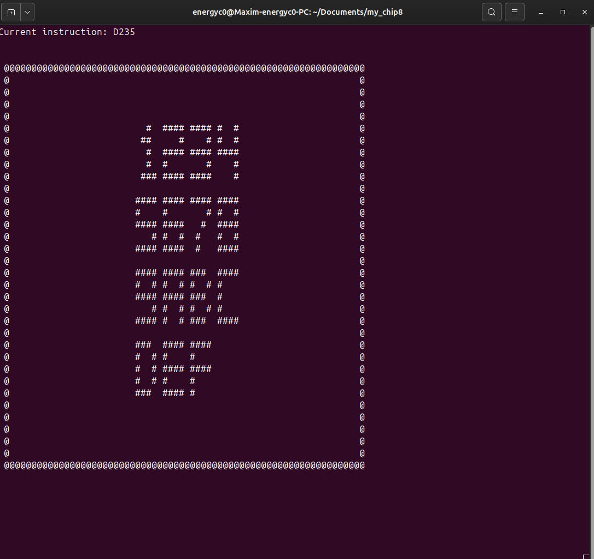
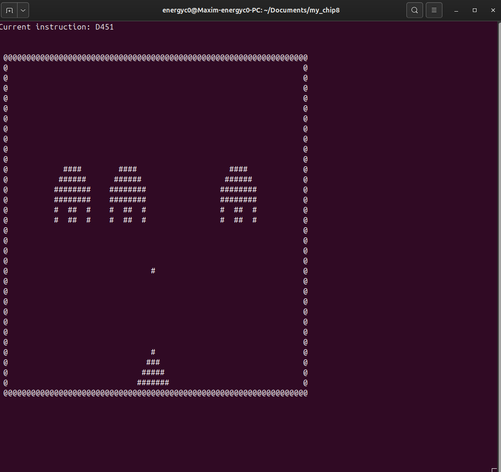

# CHIP-8 EMULATOR

## Build in Linux Ubuntu/Debian
```
  sudo apt update
  sudo apt install libncurses-dev
  make
```
## Run in Linux
```
  ./my_chip-8.out [ROM-FILE]
```

## Controls
#### CHIP-8 controls
|||||
|:---:|:---:|:---:|:---:|  
|1|2|3|C|
|4|5|6|D|
|7|8|9|E|
|A|0|B|F|

#### PC controls
|||||
|:---:|:---:|:---:|:---:|  
|1|2|3|4|
|Q|W|E|R|
|A|S|D|F|
|Z|X|C|V|
## Screenshots
#### 15PUZZLE screenshot



#### INVADERS screenshot

